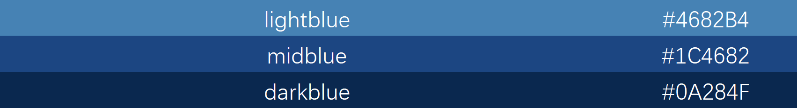
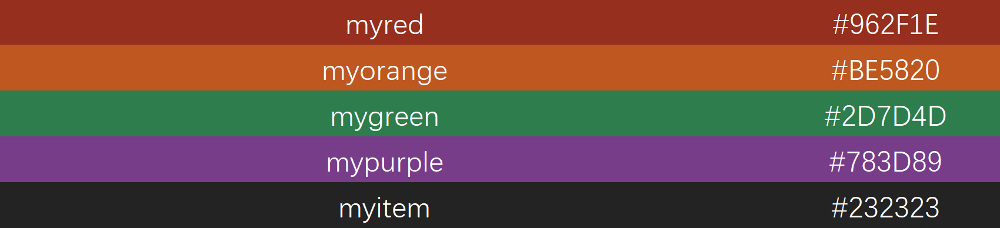

# TemplateMC 模板使用指南

> ​**作者**​：谢孔伟，李定坤，陈竟镗，宋雨菲，胡锦程，戴一冕 \*，程明明 \*

> ​**Overleaf 在线编辑**​：[点击进入模板编辑环境](https://www.overleaf.com/read/tjxdhghrsfmy#744430)

[快速使用本模板](#快速使用本模板) 

[目录](#目录) | [文件结构](#文件结构) | [主文件结构](#主文件结构) | [配置文件](#配置文件) | [颜色定义](#颜色定义) | [字体设置](#字体设置)

## 目录
<a id="目录"></a>

- [文件结构](#文件结构)
- [快速使用本模板](#快速使用本模板)
  - [1. 编译方式](#编译方式)
  - [2. 修改内容](#修改内容)
  - [3. 修改页眉和页脚配置](#修改页眉和页脚配置)
  - [4. 字体色块](#字体色块)
  - [5. 更改字体](#字体色块)
  - [6. 插入图片](#插入图片)
- [主文件结构](#主文件结构)
  - [1. 封面页](#封面页)
  - [2. 目录页](#目录页)
  - [3. 内容页](#内容页)
  - [4. 项目列表页](#项目列表页)
  - [5. 两栏内容示例页](#两栏内容示例页)
  - [6. 图像页](#图像页)
  - [7. 插入公式推导页](#插入公式推导页)
  - [8 文字强调块](#文字强调块)
  - [9. 图表](#图表)
  - [10. 问答页](#问答页)
  - [11. 结束页](#结束页)
- [配置文件](#配置文件)
  - [1. 颜色定义](#颜色定义)
  - [2. 字体设置](#字体设置)
  - [3. 页眉页脚设置](#页眉页脚设置)
  - [4. 列表样式](#列表样式)
  - [5. 表格样式](#表格样式)
  - [6. 公式背景](#公式背景)

## 文件结构
<a id="文件结构"></a>

本模板包含以下两个主要文件：

1. **`image/`**
   * 存放所有图片文件，与其他文件位于同一目录下。
2. **`TemplateMC.tex`**
   * 主文件，包含整体结构和内容。
   * 包括封面页、目录页、内容页、问答页和结束页。
   * 所有图片路径已更改为指向 `image` 文件夹中的图片，例如：`image/image1.png` 和 `image/demo.jpg`。
3. **`configs.tex`**
   * 配置文件，定义了模板的颜色、字体、主题、页眉页脚样式等。
   * 包含颜色定义、导航栏设置、列表样式、表格样式等。

```bash
/your-project-directory  
    |_ TemplateMC.tex  
    |_ configs.tex  
    |_ /image  
        |_ image1.png  
        |_ demo.jpg
```

## 快速使用本模板
<a id="快速使用本模板"></a>

预设的一些颜色 [ 颜色定义](#颜色定义)

### 1. **编译方式**
<a id="编译方式"></a>

- 使用 `XeLaTeX` 编译（模板已指定编译器）。
- 在 Overleaf 中默认会自动选择正确的编译器。

### 2. **修改内容**
<a id="修改内容"></a>

#### 改标题

- 直接修改 `\begin{frame}{标题内容}` 中的文字：

#### 封面页

- 修改标题：编辑 `\mytitle` 的内容。
- 修改作者：编辑 `\myauthor` 的内容。
- 修改机构：编辑 `\myinstitute` 的内容。

#### 目录页

- 修改目录项：在 `enumerate` 环境中添加或删除 `\item`。

#### 内容页

- 添加新页面：复制 `frame` 环境并修改内容。
- 修改表格：使用 `\ThreeLineTable` 或其他表格样式。

### 3. **修改页眉和页脚配置**
<a id="修改页眉和页脚配置"></a>

您可以通过以下方修改页眉页脚的样式和页脚的文字内容：

#### **页眉**

要修改页眉参数，请在 `configs.tex` 文件中找到以下代码块：

```latex
\setbeamertemplate{headline}{%
  \ifnum\value{framenumber}>1
    \begin{tikzpicture}[remember picture,overlay]
      \node[anchor=west, font=\normalsize, text=black, xshift=0.2cm, yshift=-0.35cm]
            at (current page.north west){\insertframetitle};
      \draw[line width=1pt, color=midblue]
            ([yshift=-0.7cm]current page.north west) -- ([yshift=-0.7cm]current page.north east);
    \end{tikzpicture}
  \fi
}
```

#### **页脚**

要修改页脚内容，请在 `configs.tex` 的页脚部分文件中找到以下代码块，可更改文字内容：

```latex
    \node[anchor=center, font=\tiny, text=white] at (leftblock.center) {程明明, http://mmcheng.net  };
    \node[anchor=center, font=\tiny, text=white] at (midblock.center) {大规模图像的多粒度目标检测};
```

### 4. **字体色块**
<a id="字体色块"></a>

使用 `BehindEqBox` 命令插入公式：

```latex
\BehindEqBox{ $ E = mc^2 $ }
```

- 修改背景颜色：在命令中添加颜色参数，例如 `\BehindEqBox[color=myred]{ ... }`。
- 修改边框样式：在命令中添加边框参数，例如 `\BehindEqBox[style=dashed,padding=4mm]{ ... }`。

| 参数名     | 含义           | 默认值     | 示例值           |
|------------|----------------|------------|------------------|
| `color`    | 背景框颜色     | `midblue`  | `red`， `mygray`  |
| `border`   | 边框粗细       | `1pt`      | `2pt`， `0.5pt`   |
| `style`    | 边框样式       | `solid`    | `dashed`， `dotted` |
| `padding`  | 内边距         | `3mm`      | `0pt`， `4mm`     |

更多说明点击链接跳转
  - [7. 插入公式推导页](#插入公式推导页)


### 5. **更改字体**
<a id="更改字体"></a>
在config.tex文件中找
```layex
% 设置英文字体
\setmainfont{Liberation Sans} 
\setsansfont{Liberation Sans}
\setmonofont{Liberation Mono}
% 设置数学公式字体
\setmathfont{TeX Gyre Termes Math} % 数学部分使用 New Roman 风格字体

% 设置中文字体（可根据需求调整）
\usepackage{xeCJK}
\setCJKmainfont{Noto Sans CJK SC} % 主要中文黑体
\setCJKsansfont{Noto Sans CJK SC}
\setCJKmonofont{Noto Sans CJK SC}
% 如果不需要区分宋体或黑体，相关宏定义可以省略
```
更多说明点击链接跳转
  - [字体设置](#字体设置)
    
### 6. **插入图片**
<a id="插入图片"></a>

使用 `includegraphics` 插入图片：

```latex
\includegraphics[width=0.68\textwidth]{demo.jpg}
```

- 修改图片路径：将 `demo.jpg` 替换为实际图片的路径。
- 修改图片大小：调整 `width` 参数。


---

## 主文件结构
<a id="主文件结构"></a>

主文件为`TemplateMC.tex`，除了页脚的文本内容更改都在这里
每页的页眉在`\begin{frame}{XXX}` 更改

### 1. **封面页**
<a id="封面页"></a>

在这里可以更改标题、姓名，机构等

```latex
\newcommand{\mytitle}{The title of the presentation is here} %更改标题
\newcommand{\myauthor}{Your Name} %更改姓名
\newcommand{\myinstitute}{Nankai University} %更改机构
```

### 2. **目录页**
<a id="目录页"></a>

提供了一个目录页，后续内容并非按照这个目录进行，内容仅为示例

```latex
\begin{frame}{Contents}
  \vspace{1em}
  \begin{enumerate}
    \item Introduction
    \item Methodology
    \item Experimental Results
    \item Conclusion
  \end{enumerate}
\end{frame}
```

### 3. **内容页**
<a id="内容页"></a>

这里给出了一个带有文字段落和表格的示例

```latex
\section{Richer convolutional feature}
\begin{frame}{Richer convolutional feature}
  \begin{itemize}
    \item APP: Classification (Res2Net-v1b)
      \begin{itemize}
        \item Results on mmdetection
      \end{itemize}
  \end{itemize}
  \vspace{0.5em}
  \centering
  \ThreeLineTable{%
    \begin{tabular}{lcccc}
      \toprule
      \textbf{Backbone}      & \textbf{Params} & \textbf{GFLOPs} & \textbf{Top-1 err.} & \textbf{Top-5 err.} \\
      \midrule
      ResNet-101           & 44.6 M  & 7.8  & 22.63 & 6.44 \\
      ResNeXt-101-64x4d    & 83.5 M  & 15.5 & 20.40 & --   \\
      %......
      \bottomrule
    \end{tabular}
  }
\end{frame}
```

#### 功能
<a id="功能"></a>

内容页包含 **标题、列表项、三线表格**，用于结构化展示技术内容（如模型参数、实验数据）。

### 4. **项目列表页**
<a id="项目列表页"></a>

```latex
\begin{frame}{\textcolor{myblue}{D}\textcolor{myred}{O}\textcolor{mygreen}{C}\textcolor{mypurple}{X} 行动倡议}
  \begin{columns}
    \column{0.5\textwidth}
    \begin{itemize}
      \item \textcolor{myblue}{D}emo: 方便科普和教学
      %...
    \end{itemize}
    \column{0.5\textwidth}
    \begin{figure}
      \centering
      \includegraphics[width=0.5\textwidth]{image/image1.png}
      \caption{示例图片}
    \end{figure}
  \end{columns}
\end{frame}
```

#### 主要功能

* **标题**：使用了彩色字体显示 `DOCX` 行动倡议的四个关键要素，通过不同颜色区分每个字母，以突出重点。
* **图片展示**：在右侧列中，展示了一张示例图片，通过 `\includegraphics` 插入图片并进行居中显示。

### 5. **两栏内容示例页**
<a id="两栏内容示例页"></a>

```latex
\begin{frame}{Two-Column Example}
\begin{columns}
    \column{0.5\textwidth}
    \begin{itemize}
        \item \textbf{Left Column Content}
        \begin{itemize}
            \item Item 1
            \item Item 2
            \item Item 3
        \end{itemize}
        \item \textbf{More Content}
        \begin{itemize}
            \item Subitem 1
            \item Subitem 2
        \end{itemize}
    \end{itemize}
    
    \column{0.5\textwidth}
    \begin{itemize}
        \item \textbf{Right Column Content}
        \begin{itemize}
            \item Item A
            \item Item B
            \item Item C
        \end{itemize}
        \item \textbf{Additional Content}
        \begin{itemize}
            \item Subitem X
            \item Subitem Y
        \end{itemize}
    \end{itemize}
\end{columns}
\end{frame}
```

#### 主要功能

* **两栏布局**：页面被分为左右两列，左侧和右侧各自显示不同的内容。
* **嵌套列表**：每列内使用了多层嵌套的无序列表，方便展示结构化的内容。

此模板适合用于并排展示两组信息或比较内容。

### 6. **图像页**
<a id="图像页"></a>

```latex
\begin{frame}{Image}
  \begin{itemize}
    \item The example image is as follows
  \end{itemize}
  \begin{figure}
    \centering
    \includegraphics[width=0.68\textwidth]{image/demo.jpg}
    \caption{示例图片}
  \end{figure}
\end{frame}
```

#### 主要功能

* **插入图片**：使用 `\includegraphics` 命令插入图片，并通过 `width` 调整图片大小。
* **图片标题**：通过 `\caption` 添加图片标题，便于说明图片内容。

此模板适合用于在幻灯片中展示图片，并为其提供简短的描述。

### 7. **插入公式推导页**
<a id="插入公式推导页"></a>

```latex
\begin{frame}{Annual Performance Metrics}
  Key Equation Analysis

  \vspace{1em}

  \begin{center}
    \BehindEqBox{
      $\displaystyle
      S = \underbrace{\sum_{i=1}^{N} \textcolor{myorange}{w_i}\, \textcolor{mygreen}{s_i}}_{\textcolor{myblue}{\textbf{Core Score}}} \;+\;
      \overbrace{\left( {\frac{1}{N} \sum_{j=1}^{M} \textcolor{myred}{\delta_j}} \right)}^{\textcolor{mypurple}{\textbf{Adjustment Factor}}}
      $
    }
  \end{center}

  \vspace{1em}

  \[
    \left\{
    \begin{aligned}
      \textcolor{mygreen}{s_i} &\;=\; \text{Standardized score for module } i, \\
      \textcolor{myorange}{w_i} &\;=\; \text{Weight assigned to module } i, \\
      \textcolor{myred}{\delta_j} &\;=\; \text{External adjustment from factor } j.
    \end{aligned}
    \right.
  \]

  \vspace{1em}

  \textbf{Remark:} Here, \(S\) represents the overall performance metric of an annual study. The \textcolor{myblue}{Core Score} is the weighted sum of standardized scores \(s_i\), while the \textcolor{mypurple}{Adjustment Factor} accounts for external influences aggregated via \(\delta_j\).

\end{frame}
```

#### 主要功能

* **公式展示**：使用 \BehindEqBox 命令为公式添加背景色和边框，增强视觉效果。
* **变量高亮**：通过 \textcolor 命令对公式中的不同变量进行颜色标注，便于区分和说明。
* **公式解析**：在公式下方使用 aligned 环境详细解释各变量的含义，提升公式的可读性。

此模板适用于在幻灯片中展示关键公式，并对其进行详细解析和说明。

#### ✅ `\BehindEqBox` 使用说明

该命令用于给公式添加背景框，支持自定义颜色、边框、样式和内边距。默认样式美观简洁，参数可选、顺序不限。

##### **基本用法：**

```latex
\BehindEqBox{$\displaystyle a^2 + b^2 = c^2$}
```

- 显示一个公式，自动带有淡蓝色背景框、1pt 实线边框和适当内边距。（默认参数）

---

##### **可选参数：**

你可以用如下键值对格式设置样式（顺序不限）：

| 参数名     | 含义           | 默认值     | 示例值           |
|------------|----------------|------------|------------------|
| `color`    | 背景框颜色     | `midblue`  | `red`, `mygray`  |
| `border`   | 边框粗细       | `1pt`      | `2pt`, `0.5pt`   |
| `style`    | 边框样式       | `solid`    | `dashed`, `dotted` |
| `padding`  | 内边距         | `3mm`      | `0pt`, `4mm`     |

##### **示例：**

```latex
% 改变背景颜色
\BehindEqBox[color=red]{$\displaystyle E = mc^2$}

% 改为虚线边框
\BehindEqBox[style=dashed]{$\displaystyle x^2 + y^2 = r^2$}

% 同时修改多个属性
\BehindEqBox[color=black, border=2pt, padding=4mm]{$\displaystyle F = ma$}

% 取消内边距（紧贴内容）
\BehindEqBox[padding=0pt]{$\displaystyle \int_a^b f(x)\,dx$}
```

### 8 **文字强调块**
<a id="文字强调块"></a>

在 Beamer 中，可以使用不同类型的色块（block）来**强调内容**、**区分信息类型**，让幻灯片更清晰有重点。

| 类型           | 命令名           | 用途说明                              |
|----------------|------------------|---------------------------------------|
| 普通信息块     | `block`          | 一般性内容说明                        |
| 警告信息块     | `alertblock`     | 用于提示重要、需注意或高风险内容     |
| 示例/重点块    | `exampleblock`   | 用于强调关键点、总结、案例或结论     |

#### 基本语法：

```latex
\begin{block}{标题}
内容...
\end{block}

\begin{alertblock}{标题}
内容...
\end{alertblock}

\begin{exampleblock}{标题}
内容...
\end{exampleblock}
```

#### 示例展示：

```latex
\begin{block}{Information Block}
This is a general informational block.
\end{block}

\begin{alertblock}{Warning}
This is important information inside a red alert block.
\end{alertblock}

\begin{exampleblock}{Key Takeaways}
This block highlights essential information in a green box.
\end{exampleblock}
```

- `block` 更中性，适合普通说明；
- `alertblock` 显眼醒目，避免滥用；
- `exampleblock` 常用于展示总结、重点、例子等；
- 文字太多时可以适当增加 `\vspace{0.5em}` 来增强可读性。

---

### 9. **图表**
<a id="图表"></a>

```latex
\begin{frame}{Bar charts}

\begin{center}
\begin{tikzpicture}
\begin{axis}[
    ybar,
    bar width=8pt,
    width=0.7\textwidth,
    height=0.5\textwidth,
    enlarge x limits=0.2,
    ylabel={Bar},
    xlabel={Foo},
    symbolic x coords={1,2,3,4},
    xtick=data,
    ymin=0,
    ymax=30,
    legend style={at={(0.98,0.98)}, anchor=north east},
    nodes near coords,
    nodes near coords align={vertical},
    every node near coord/.append style={font=\tiny},
    tick label style={font=\small},
]
\addplot+[style={fill=blue!40}] coordinates {(1,20) (2,25) (3,22) (4,13)};
\addplot+[style={fill=yellow!60!white}] coordinates {(1,18) (2,24) (3,23) (4,14)};
\addplot+[style={fill=green!60!black}] coordinates {(1,10) (2,19) (3,25) (4,16)};
\legend{lorem, ipsum, dolor}
\end{axis}
\end{tikzpicture}
\end{center}

\end{frame}
```

* **条形图绘制**：使用 pgfplots 宏包的 axis 环境绘制条形图，设置 ybar 参数表示纵向条形。
* **坐标与标签**：通过 symbolic x coords 定义横坐标标签，xlabel 和 ylabel 设置坐标轴标题。
* **图例与样式**：使用 legend 添加图例，addplot 设置不同颜色的条形以区分数据系列。

### 10. **问答页**
<a id="问答页"></a>

```latex
\begin{frame}{Questions and Answers}
  \centering
  \vspace{0.8cm}
  {\Huge \bfseries Q\&A}
\end{frame}
```

* **问答提示**：在幻灯片中间以大号加粗字体显示“Q&A”，提示进入问答环节。
* **居中对齐**：使用 \centering 和 \vspace 控制文本的居中和垂直间距。

此模板适用于演示文稿中的问答环节，引导观众参与互动。

### 11. **结束页**
<a id="结束页"></a>

```latex
\begin{frame}[plain]
  \begin{tikzpicture}[remember picture,overlay]
    \node[fill=midblue, opacity=1, minimum width=\paperwidth, minimum height=\paperheight] at (current page.center) {};
    \node[font=\fontsize{40}{70}\selectfont\bfseries, text=white] at (current page.center) {THANKS};
  \end{tikzpicture}
\end{frame}
```

* **自定义背景**：使用 tikzpicture 绘制深蓝色背景，覆盖整个幻灯片。
* **感谢文本**：在幻灯片中央以大号白色加粗字体显示“THANKS”

此模板适用于演示文稿的结束页，向观众表达感谢之情。

---

## 配置文件
<a id="配置文件"></a>

### 1. **颜色定义**
<a id="颜色定义"></a>

[返回快速使用本模板](#快速使用本模板)

在 `configs.tex` 中定义的颜色供模板使用，下面的颜色表以直观的色块展示各颜色及其 RGB 值，整体风格简洁大气，适合于技术文档和论文模板。
#### 颜色示例： 
* **主题色**
`lightblue` `midblue` `darkblue`

  

* **其他颜色**
`myred` `myorange` `mygreen` `mypurple` `myitem`

  

---

### 2. **字体设置**
<a id="字体设置"></a>

在 `configs.tex` 中已加载以下宏包以实现中西文字体统一管理：

latex

```latex
\usepackage{fontspec}
\usepackage{xeCJK}
\usepackage{unicode-math}
```

#### 英文字体设置

* ​**正文字体**​：使用 `\setmainfont` 设置，若要将正文字体修改为 Times New Roman（新罗马字体），可使用 `\setmainfont{Times New Roman}`。

latex

```latex
\setmainfont{Times New Roman}
```

* ​**无衬线字体**​：使用 `\setsansfont` 设置，若修改为新罗马字体类似的无衬线字体，可根据实际字体情况设置，比如 `\setsansfont{Arial}` （Arial 是常见无衬线字体）。若想坚持使用新罗马风格无衬线字体（如果有对应字体），假设字体名为 `Times New Roman Sans`，则：

latex

```latex
\setsansfont{Times New Roman Sans}
```

* ​**等宽字体**​：使用 `\setmonofont` 设置，若要修改为 Consolas（常见等宽字体），可使用 `\setmonofont{Consolas}`。若有新罗马风格等宽字体（假设名为 `Times New Roman Mono`），则：

latex

```latex
\setmonofont{Times New Roman Mono}
```

#### 数学公式字体设置

使用 `\setmathfont` 设置数学公式字体，若想让数学部分使用新罗马风格字体，示例：

latex

```latex
\setmathfont{TeX Gyre Termes Math} % 该字体类似 New Roman 风格
```

#### 中文字体设置

* ​**主要中文字体**​：用 `\setCJKmainfont` 设置，如 `\setCJKmainfont{Noto Sans CJK SC}`。若要更换中文字体，例如更换为宋体（假设系统中有 `SimSun` 字体），则：

latex

```latex
\setCJKmainfont{SimSun}
```

* ​**中文无衬线字体**​：使用 `\setCJKsansfont`，例 `\setCJKsansfont{Noto Sans CJK SC}`。若要更换为黑体（假设系统中有 `SimHei` 字体），则：

latex

```latex
\setCJKsansfont{SimHei}
```

* ​**中文等宽字体**​：用 `\setCJKmonofont`，如 `\setCJKmonofont{Noto Sans CJK SC}`。若要更换为其他等宽中文字体，可按需设置。

若无需区分宋体或黑体，相关宏定义可省略。

### 3. **页眉页脚设置**
<a id="页眉页脚设置"></a>

- **页眉**：显示当前页面的标题（`frametitle`），顶部有一条蓝色分隔线。
- **页脚**：分为三部分：
  - 左侧：作者信息和链接
  - 中间：项目名称
  - 右侧：当前页码

### 4. **列表样式**
<a id="列表样式"></a>

- **无序列表**：默认使用圆形图标，大小可切换（大圆圈或小圆圈）。
- **有序列表**：数字编号，颜色为深蓝色。

### 5. **表格样式**
<a id="表格样式"></a>

提供了三种表格样式：

- **普通表格**：`PlainTable`
- **三线表**：`ThreeLineTable`
- **交替颜色表格**：`AltColorTable`

### 6. **公式背景**
<a id="公式背景"></a>

提供了一个公式背景框命令 `BehindEqBox`，可以自定义背景颜色、边框样式和间距。

---

## 总结
<a id="总结"></a>

本模板提供了一个美观且功能丰富的框架，适合学术报告或项目展示。通过修改 `configs.tex` 和 `TemplateMC.tex` 中的内容，您可以轻松定制模板的样式和内容。希望本 README 能帮助您快速上手，欢迎大家使用！

